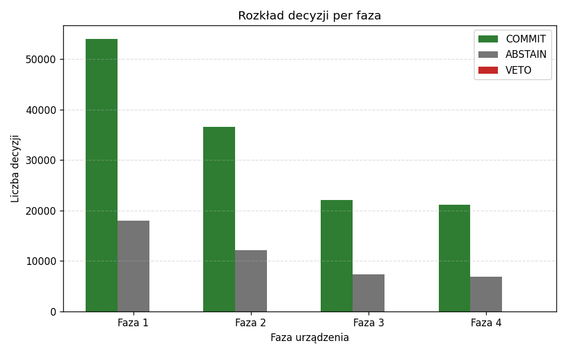
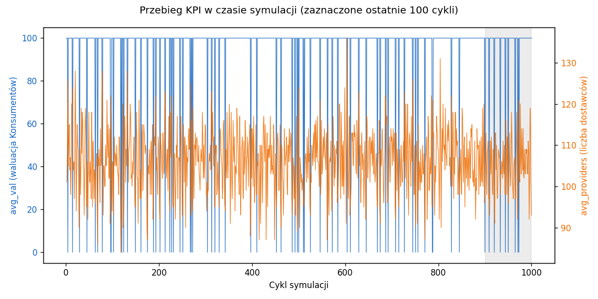
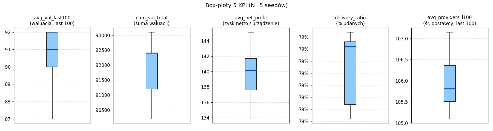

# SPH Symulator Strategii v1.1

Symulator porównuje strategie podejmowania decyzji (COMMIT/ABSTAIN) w systemie zawodnych urządzeń autonomicznych z 5 fazami eksploatacji. Projekt na ekonometrię. `RationalAgent` filtruje decyzje o ujemnej oczekiwanej wartości.

> Najszybszy start: `python sph_sim.py --tutorial`. Interaktywny przewodnik po wszystkich funkcjach v1.1 (~15 min).
>
> Reszta tego pliku opisuje to samo na piśmie. Można czytać liniowo lub używać jako referencji.

## Szybki start (60 sekund)

```bash
git clone <repo-url> && cd ekonometria-2
pip install -r requirements.txt

# Baseline. Oczekiwany wynik: avg_val_last100 = 92.0
python sph_sim.py --strategy naive --zeta 0.75 --seed 42 --json --no-agent
```

Raport MD i 2 wykresy PNG zapisują się automatycznie w `./reports/<timestamp>/`. Przykładowy fragment `report.md`:

```markdown
## Konfiguracja środowiska
| Parametr | Wartość |
|----------|---------|
| nU       | 100     |
| T        | 500     |
| seed     | 42      |

## Metryki KPI
| KPI                | Wartość |
|--------------------|---------|
| avg_val_last100    | 92.00   |
| avg_net_profit     | 140.76  |
```

Żeby zobaczyć interaktywny przewodnik z auto-weryfikacją kroków: `python sph_sim.py --tutorial`.

## Interaktywny tutorial

Uruchomienie:

- Z poziomu CLI: `python sph_sim.py --tutorial`. REPL startuje od razu w trybie tutorial.
- Z poziomu REPL: wpisz `tutorial` po `python sph_sim.py --interactive`.

Sterowanie (4 komendy działają tylko w trybie tutorial):

| Komenda  | Działanie                                                              |
|----------|------------------------------------------------------------------------|
| `skip`   | Przejdź do następnego kroku bez weryfikacji.                           |
| `back`   | Cofnij do poprzedniego kroku (na pierwszym kroku komunikat o granicy). |
| `repeat` | Wyświetl bieżący krok ponownie.                                        |
| `exit`   | Wyjdź z tutoriala (REPL zachowany. Wpisz `exit` ponownie, żeby zamknąć).|

Przykładowy nagłówek kroku (tak wygląda krok w REPL):

```
[krok 1/9 — Baseline]
══════════════════════════════════════════════════════════
Uruchom symulację baseline dla strategii naive:

  run naive zeta=0.75

To podstawowy punkt odniesienia (KPI = 92).
══════════════════════════════════════════════════════════
sph>
```

Tutorial nie wykonuje komend za ciebie. Komendy wpisujesz sam. Każdy krok zapisuje raporty do osobnego katalogu `./reports/tutorial-<ts>/step-N-<topic>/`, więc nie nadpisują zwykłych raportów.

## Opis funkcjonalności v1.1

### 1. Tryb interaktywny (REPL)

REPL to ekran startowy `sph>` z 9 komendami: `help`, `exit`, `strategies`, `strategy`, `tutorial`, `custom`, `run`, `compare`, `batch`. Wszystkie komunikaty są po polsku, historia poleceń trzymana jest w `~/.sphsim_history` (czyta i zapisuje przy starcie/zakończeniu). REPL używa stdlib `cmd` + `readline`, więc działają strzałki w górę/dół, edycja linii, Ctrl-C i Ctrl-D.

Typowy scenariusz odkrywczy. Wpisz `help`, potem `strategies`, potem `strategy incentive`, żeby zobaczyć parametry konkretnej strategii, i `exit` żeby zakończyć:

```bash
printf 'help\nstrategies\nstrategy incentive\nexit\n' | python sph_sim.py --interactive
```

### 2. Własna strategia (custom loader)

Własną strategię definiujesz jako plik `.py` z funkcją `strategy_<nazwa>(dev, l, s, phi, kappa, rho, h, p)` oraz słownikiem `STRATEGY_META`. Loader (`importlib`) rejestruje plik w prywatnym namespace `sphsim.custom.<nazwa>` i dodaje do `STRATEGIES`. Z CLI używaj flagi `--custom <ścieżka>`, w REPL komendy `custom <ścieżka>`. Szablon znajdziesz w `examples/custom_strategy_template.py`.

Uwaga bezpieczeństwa: loader wykonuje arbitralny Python z pliku użytkownika. Ładuj wyłącznie pliki, którym ufasz. Projekt jest świadomie lokalny i edukacyjny, ale to nadal `exec` cudzego kodu.

```bash
python sph_sim.py --custom examples/custom_strategy_template.py --json --no-agent
```

### 3. Racjonalny agent (veto)

`RationalAgent` to warstwa pomiędzy strategią a symulatorem. Domyślnie włączona. Wetuje (override `COMMIT → ABSTAIN`) każdy ruch, dla którego oczekiwany zysk `E[zysk_i] = (1−φ_i)·p_i − κ − φ_i·ρ_i < 0`. Pełna formuła i dydaktyczny dowód incentive compatibility w sekcji Teoria poniżej.

Żeby zobaczyć surową strategię (bez agenta), użyj `--no-agent`. Żeby porównać oba przebiegi obok siebie (delta KPI, tabela vetoes per faza), użyj `--compare-agent`:

```bash
python sph_sim.py --strategy naive --zeta 0.95 --seed 42 --compare-agent --json
```

Empiryczny dowód, że agent chroni KPI: dla `naive --zeta 0.95` weto daje `delta.avg_net_profit ≈ +196.83` przy `n_vetoed_total = 21299` (głównie fazy 4-5).

### 4. Konfigurowalne środowisko

Możesz nadpisać parametry środowiska: profil awarii `--phi p1,p2,p3,p4,p5` (5 floatów w [0,1]), koszty naprawy `--rho r1,r2,r3,r4,r5` (5 floatów ≥ 0), funkcję waluacji `--valuation window|step|linear`, oraz progi `--K0`/`--K1`. Walidacja w argparse zwraca polskie komunikaty (np. `--phi wymaga dokładnie 5 wartości` lub `--phi[1]=1.5 poza zakresem [0, 1]`).

```bash
python sph_sim.py --strategy naive --phi 0.1,0.2,0.3,0.4,0.5 --rho 1,2,3,4,5 \
                  --valuation step --seed 42 --json --no-agent
```

Trzy presety waluacji (`window`/`step`/`linear`) przy `--zeta 0.75 --seed 42` dają trzy różne wartości `avg_val_last100`: 92.0 / 93.0 / 87.52. To pozwala badać wrażliwość strategii na kształt funkcji `g(u)`.

### 5. Raport Markdown i wykresy PNG

Po każdej symulacji (CLI lub REPL) tworzony jest katalog `./reports/<timestamp>/` z trzema plikami:

- `report.md`. Konfiguracja środowiska, parametry strategii, tabela 5 KPI, rozkład decyzji per faza, porównanie z baseline, relatywne linki do PNG.
- `decision_distribution.png`. Rozkład decyzji COMMIT/ABSTAIN/VETO per faza (1..5).
- `kpi_timeseries.png`. Przebieg `avg_val` w czasie z zaznaczonym oknem ostatnich 100 cykli.

Generowanie jest zawsze włączone (nie ma flagi `--plot`). Żeby raporty regresyjne nie zaśmiecały dysku, jest opt-out: `SPHSIM_NO_REPORT=1`.





*Wykresy wygenerowane matplotlib 3.x z `--seed 42`. Przy różnych wersjach matplotlib piksele mogą się nieznacznie różnić, wartości KPI są identyczne.*

```bash
python sph_sim.py --strategy adaptive --s_target 10 --seed 42 --json
# → ./reports/<ts>/report.md + decision_distribution.png + kpi_timeseries.png
```

### 6. Batch runner i agregacja

Tryb batch (`--batch --seeds <N|lista>`) uruchamia tę samą konfigurację dla wielu seedów i agreguje 5 KPI: mean, std, min, max, 95% CI (t-rozkład, df=N−1), oraz wydaje werdykt „bije baseline" gdy `CI_lower > 92.0`. Wynik na stdout to czytelne BATCH SUMMARY; pełna tabela per-seed plus agregat są w `./reports/batch_<ts>/report.md`. Limit `MAX_SEEDS=1000` chroni przed OOM.

```bash
python sph_sim.py --strategy naive --zeta 0.75 --batch --seeds 10 --json --no-agent
```



### 7. Pełny pipeline (cross-feature)

Funkcje można łączyć dowolnie. Można np. uruchomić batch własnej strategii z nadpisanym środowiskiem:

```bash
python sph_sim.py --custom examples/custom_strategy_template.py \
                  --batch --seeds 5 --json --no-agent
```

Backwards-compatibility gwarantowana przez `scripts/regression_check.py`. 8 fixtures z v1.0 musi przechodzić byte-identical dla wszystkich 5 wbudowanych strategii.

## Referencja

### Flagi CLI (alfabetycznie)

| Flaga             | Typ                | Domyślnie               | Opis                                                                  |
|-------------------|--------------------|-------------------------|-----------------------------------------------------------------------|
| `--alpha`         | float              | DEFAULT_ALPHA           | Wykładnik `h(i) = i^alpha`.                                           |
| `--batch`         | bool (flag)        | false                   | Tryb batch. Uruchom strategię N razy (wymaga `--seeds`).              |
| `--compare-agent` | bool (flag)        | false                   | Uruchom 2x: z agentem i bez. Tabela delta KPI.                        |
| `--custom`        | str (path)         | None                    | Ścieżka do pliku `.py` z custom strategią.                            |
| `--expected_P`    | float              | 100.0                   | `[incentive|agent]` Oczekiwana płatność.                              |
| `--interactive`   | bool (flag)        | false                   | Uruchom tryb interaktywny (REPL).                                     |
| `--json`          | bool (flag)        | false                   | Wynik jako JSON (do parsowania).                                      |
| `--K0`            | float              | DEFAULT_K0              | Dolny próg waluacji `K0`.                                             |
| `--K1`            | float              | DEFAULT_K1              | Górna granica waluacji `K1`.                                          |
| `--kappa`         | float              | DEFAULT_KAPPA           | Koszt dostarczenia `κ`.                                               |
| `--max_phase`     | int                | 3                       | `[threshold]` Max faza COMMIT.                                        |
| `--no-agent`      | bool (flag)        | false                   | Wyłącz RationalAgent (surowa strategia, bez veto).                    |
| `--nSUS`          | int                | DEFAULT_NSUS            | Pojemność bufora SUS.                                                 |
| `--nU`            | int                | DEFAULT_NU              | Liczba urządzeń.                                                      |
| `--param`         | str (k=v)          | []                      | `[--custom]` Parametr custom strategii (repeatable).                  |
| `--phi`           | list[float] × 5    | 0.1,0.2,0.3,0.4,1.0     | Profile awarii φ (5 liczb w [0,1]).                                   |
| `--probs`         | str                | 0.9,0.7,0.5,0.3,0.0     | `[phase_prob]` P(COMMIT) per faza.                                    |
| `--rho`           | list[float] × 5    | 0.5,0.5,0.7,1.5,3.0     | Koszty naprawy ρ (5 liczb ≥ 0).                                       |
| `--seed`          | int                | 42                      | Ziarno losowe.                                                        |
| `--seeds`         | int / lista        | None                    | `[--batch]` Lista seedów: N (1..N) lub jawna (1,5,42). Limit 1000.    |
| `--strategy`      | choice             | —                       | Wbudowana strategia: naive / threshold / phase_prob / incentive / adaptive. |
| `--s_target`      | int                | 10                      | `[adaptive]` Próg SUS.                                                |
| `--T`             | int                | DEFAULT_T               | Liczba cykli symulacji.                                               |
| `--tutorial`      | bool (flag)        | false                   | Uruchom interaktywny tutorial v1.1 (≤15 min).                         |
| `--valuation`     | choice             | window                  | Preset funkcji waluacji: `window` / `step` / `linear`.                |
| `--verbose`       | bool (flag)        | false                   | Szczegółowe logi co 100 cykli.                                        |
| `--zeta`          | float              | 0.5                     | `[naive]` Frakcja COMMIT (0..1).                                      |

### Komendy REPL (alfabetycznie)

| Komenda     | Składnia                                              | Opis                                                                   |
|-------------|-------------------------------------------------------|------------------------------------------------------------------------|
| `batch`     | `batch <nazwa> --seeds N\|lista [k=v ...]`            | Uruchom strategię na wielu seedach (agregat statystyczny).             |
| `compare`   | `compare <nazwa> [k=v ...]`                           | Porównaj strategię z i bez RationalAgent (delta KPI).                  |
| `custom`    | `custom <ścieżka> [k=v ...]`                          | Załaduj custom strategię z pliku `.py`.                                |
| `exit`      | `exit`                                                | Zakończ sesję (alternatywnie Ctrl+D).                                  |
| `help`      | `help`                                                | Wyświetl listę dostępnych komend.                                      |
| `run`       | `run <nazwa> [k=v ...]`                               | Uruchom symulację (built-in lub custom).                               |
| `strategies`| `strategies`                                          | Wyświetl listę wbudowanych i custom strategii.                         |
| `strategy`  | `strategy <nazwa>`                                    | Wyświetl szczegóły strategii (parametry, baseline KPI).                |
| `tutorial`  | `tutorial`                                            | Uruchom interaktywny tutorial v1.1 (≤15 min).                          |

### Wbudowane strategie (STRATEGY_META)

| Nazwa        | Opis                                            | Kluczowy parametr | Baseline KPI (`avg_val_last100`) |
|--------------|-------------------------------------------------|-------------------|----------------------------------|
| `naive`      | COMMIT z prawdopodobieństwem zeta               | `zeta`            | 92.0 (`naive --zeta 0.75`)       |
| `threshold`  | COMMIT tylko dla faz ≤ max_phase                | `max_phase`       | —                                |
| `phase_prob` | COMMIT z P(commitów) per faza                   | `probs`           | —                                |
| `incentive`  | COMMIT gdy E[zysk_netto] > 0                    | `expected_P`      | —                                |
| `adaptive`   | COMMIT zależnie od poziomu bufora SUS           | `s_target`        | —                                |

## Teoria (krótki opis)

### Model SPH

System składa się z `nU` zawodnych urządzeń autonomicznych w cyklu UP/DOWN, każde aktualnie znajdujące się w fazie eksploatacji 1..5 (faza 5 = krytyczne ryzyko awarii). W każdym cyklu strategia podejmuje dla każdego urządzenia decyzję: `COMMIT` (zaakceptuj zadanie, zaryzykuj awarię) lub `ABSTAIN` (odmów, zachowaj urządzenie do dalszego użytku). `RationalAgent` może dodatkowo wystawić VETO. Zamienia `COMMIT` na `ABSTAIN`, jeśli oczekiwany zysk jest ujemny.

### KPI (5 podstawowych)

- `avg_val_last100`. Średnia wartość waluacji `g(u)` w ostatnich 100 cyklach (główny KPI, baseline = 92.0 dla `naive --zeta 0.75`).
- `avg_net_profit`. Średni zysk netto z transakcji, uwzględniający koszty `κ` i naprawy `ρ`.
- `delivery_ratio`. Frakcja udanych dostarczeń względem prób.
- `avg_providers_l100`. Średnia liczba aktywnych dostawców w ostatnich 100 cyklach.
- `cum_val_total`. Łączna wartość waluacji za pełen przebieg.

### Racjonalny agent (RationalAgent)

`RationalAgent` to deterministyczny wrapper wokół dowolnej strategii. Dla każdej decyzji `COMMIT` oblicza:

```
E[zysk_i] = (1 − φ_i) · p_i  −  κ  −  φ_i · ρ_i
```

gdzie `φ_i` to prawdopodobieństwo awarii w fazie `i`, `p_i` to oczekiwana płatność dla urządzenia w fazie `i` (proporcjonalna do `h(i)` względem sumy aktywnych dostawców), `κ` to koszt dostarczenia, `ρ_i` to koszt naprawy. Gdy `E[zysk_i] < 0`, agent zamienia `COMMIT` na `ABSTAIN`. Weryfikuje to `--compare-agent`: dla `naive --zeta 0.95` agent uratował średnio +196.83 jednostek zysku per uruchomienie (z 21299 veto, głównie w fazach 4-5).

### Incentive compatibility (dydaktyczne)

Konstrukcja `E[zysk_i]` to warunek motywacyjnej zgodności znany z teorii mechanizmów: każda decyzja, którą agent zaakceptuje, ma nieujemną oczekiwaną wartość dla urządzenia. Na przykładzie gry SPH widać, że można zbudować deterministyczny filtr bezpieczeństwa, który chroni KPI bez zmiany samej strategii (tylko ją filtruje), a każdą decyzję filtra da się prześledzić wstecz.

### Materiały dodatkowe

- Eksperymenty, wyniki, dyskusja: [Raport.pdf](Raport.pdf)
